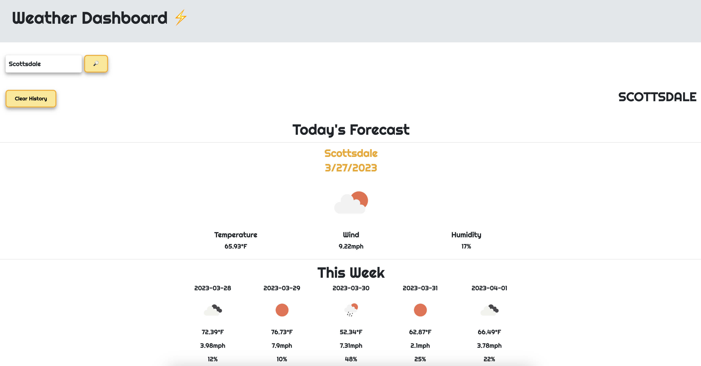

# Weather Dashboard

## Deployed Site
https://elawilliam.github.io/weather-dashboard/

## Description
Third-Party APIs allow developers to access their data and functionality by making requests with specific parameters to a URL. Developers are often tasked with retrieving data from another application's API and using it in the context of their own. This application utilizes the "5 Day Weather Forecast" data from the "Open Weather Map" API. It runs in the browser and features dynamically updated HTML and CSS.

## Usage
Intended for users looking to check the weather online.

## Mock-Up

## License
Please see license information outlined in the repository.